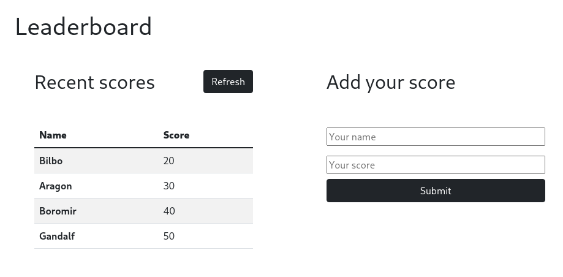

# Leaderboard
The leaderboard website displays scores submitted by different players. It also allows you to submit your score. All data is preserved thanks to the external Leaderboard API service.

## Built With

- Javascript
- Webpack
- HTML 5
- CSS 3

## Live Demo

[Live Demo Link](##)

## Authors

👤 **Manuel Aldaraca**

- GitHub: [@vicmaburrito](https://github.com/vicmaburrito)
- LinkedIn: [Manuel Aldaraca](https://www.linkedin.com/in/manuel-aldaraca)

## 🤝 Contributing

Contributions, issues, and feature requests are welcome!

Feel free to check the [issues page](https://github.com/vicmaburrito/To-do_list/issues/new).

## Show your support

Give a ⭐️ if you like this project!

## 📝 License

This project is [MIT](./LICENSE.md) licensed.