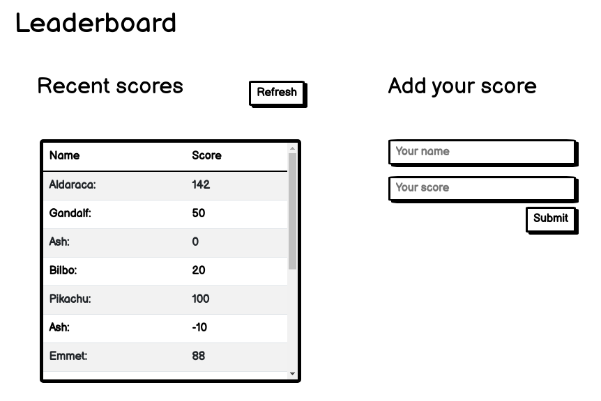

# Leaderboard
The leaderboard website displays scores submitted by different players. It also allows you to submit your score. All data is preserved thanks to the external Leaderboard API service.



## Built With

- Javascript
- Webpack
- HTML 5
- CSS 3

## Usage
### Local installation
```console
$ git clone git@github.com:vicmaburrito/Leaderboard.
$ cd Leaderboard
$ npm install 
```

### To run the project
```console
$ npm start 
```

### API 
The current API in production is [Leaderboard](https://www.notion.so/Leaderboard-API-service-24c0c3c116974ac49488d4eb0267ade3)

#### **Endpoints**

**/games/**

Allowed actions:

- POST to create a new game

Mandatory parameters for POST action:

- name: name of the game

Parameters example for POST action (sent in the body of the request in JSON format):
```JSON
{ 
	"name": "Hello there!" 
}
```
Return value: unique identifier for the game
```JSON
{ 
	"result": "Game with ID: OyWOyYBAfoODiap1EhZ8 added."
}
```

## Live Demo

[Live Demo Link](https://vicmaburrito.github.io/Leaderboard/dist/index.html)

## Authors

👤 **Manuel Aldaraca**

- GitHub: [@vicmaburrito](https://github.com/vicmaburrito)
- LinkedIn: [Manuel Aldaraca](https://www.linkedin.com/in/manuel-aldaraca)

## 🤝 Contributing

Contributions, issues, and feature requests are welcome!

Feel free to check the [issues page](https://github.com/vicmaburrito/To-do_list/issues/new).

## Show your support

Give a ⭐️ if you like this project!

## 📝 License

This project is [MIT](./LICENSE.md) licensed.
